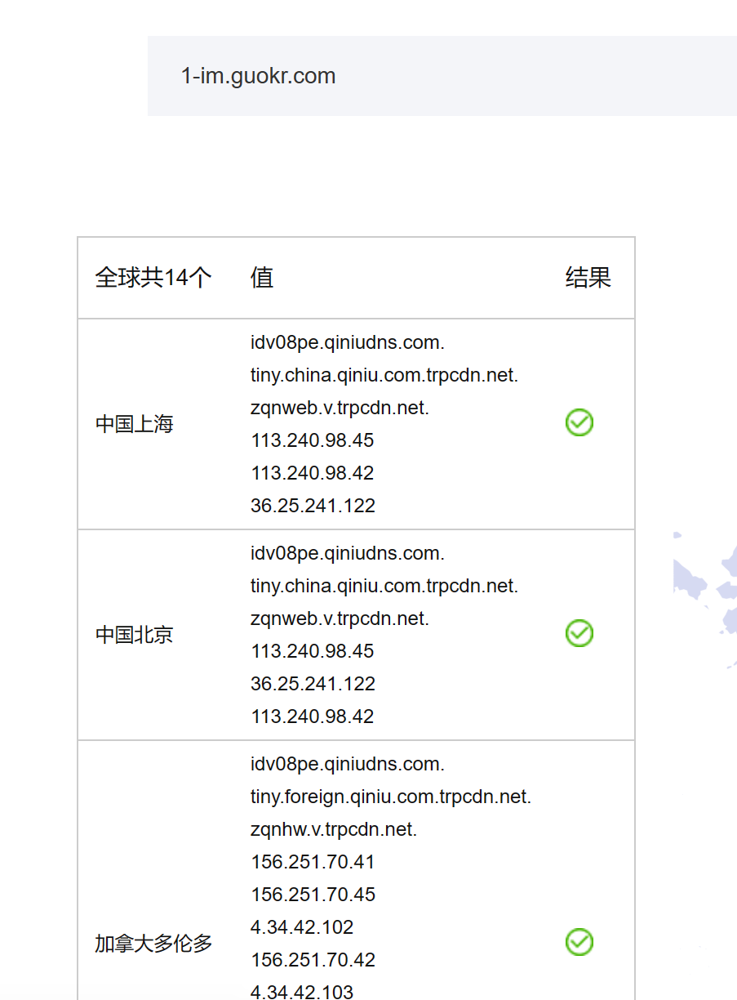

# 分析图片渲染问题的可能原因

* 对于无法正常显示网络图片的可能解释

  现象：在引用时无法正常显示

  

  引用其他网址正常

  

  F12发现对方服务器返回403forbidden

  感觉是那个网站禁用了图片的外链访问

  于是对无法访问的网址的dns进行查询

  

  该网址指向了七牛云存储图片 这类对象存储服务大概率使用的是按流量计费

  可能对方设置了通过禁止其他域名访问来防止资源过度被使用

  即在早年论坛中常见的问题：网站禁用图片外链/防盗链

