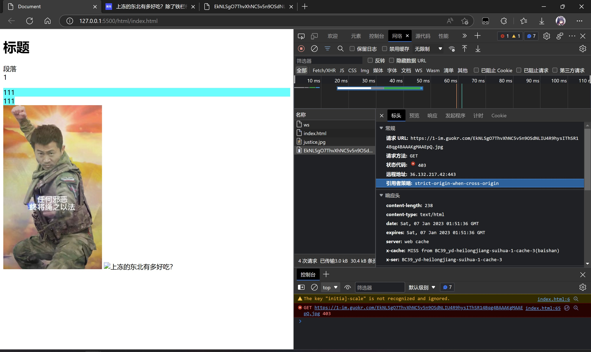
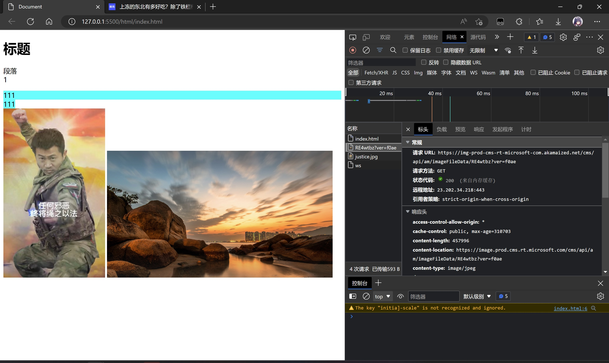

# 对于有些时候无法正常显示网络链接引用的图片的可能解释

现象：在引用有些外链图片时无法正常显示

而引用其他网址正常

F12发现异常时对方服务器返回403forbidden

感觉是那个网站禁用了图片的外链访问

于是对无法引用外链图片的网址查询dns

该网址指向了七牛云存储图片 这类对象存储服务大概率使用的是按流量计费

可能对方设置了通过禁止其他域名访问来防止资源过度被使用

即在早年论坛中常见的问题：网站禁用图片外链/防盗链

