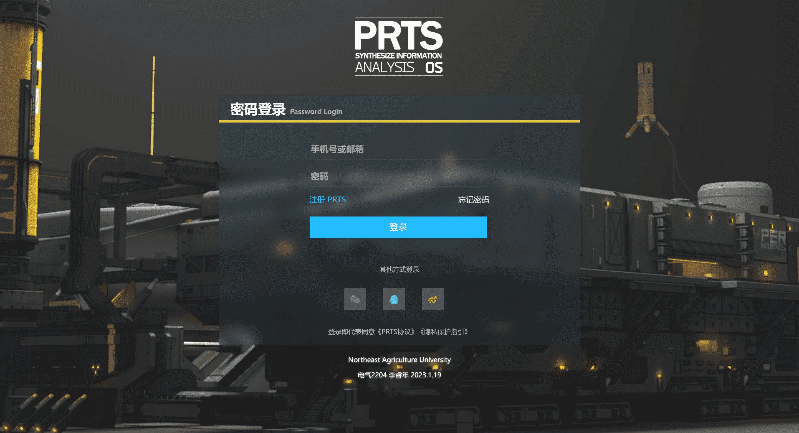
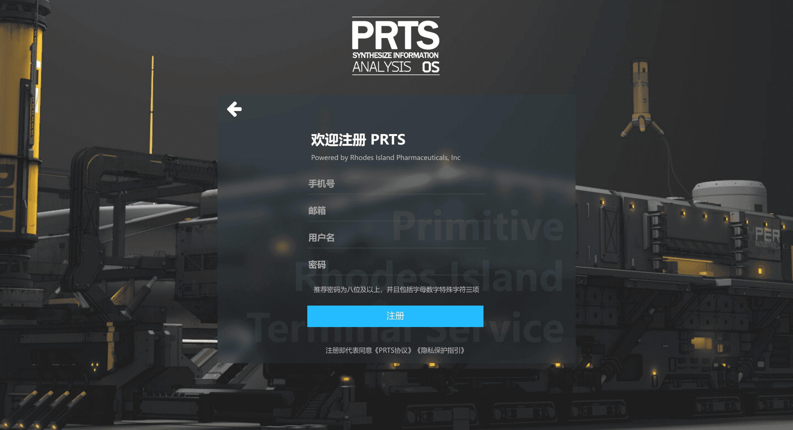
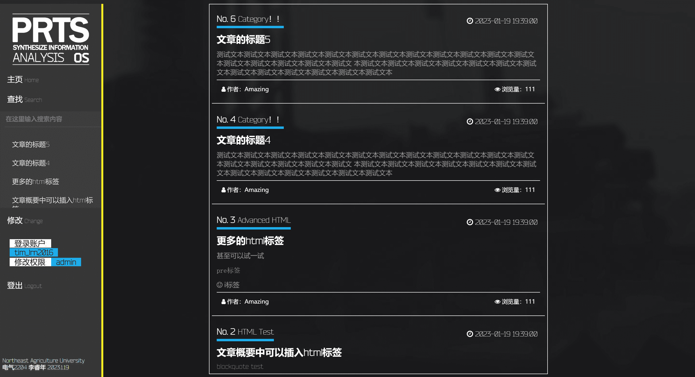

# 第一次大作业-文章框架使用介绍

## 项目简介

(使用原生 html js css 且前后端分离)

根据大作业要求，本文将介绍前端部分 (frontend 文件夹)

> 简要介绍含后端版本（backend 文件夹）：
>
> 使用 python(Flask 框架)、sqlite3 完成
>
> 测试版本： python 3.11.0 Flask 2.2.2 sqlite3 使用自带库
>
> 为保证数据库安全性，**数据库操作均在后端完成**
>
> - 服务器后端在 5000 端口建立网站
> - 含与数据库对接的账户登录注册和权限管理
> - 含文章数据库增删改查操作
>
> TODO:
>
> - 不使用 login_flag=1 来判断登录，增加加密和校验措施
> - 使用go重构前端
> - 数据库改为 mysql

**电气 2204 李睿年**

**1.19 结束前端开发 1.21 结束后端开发**

## 主要功能

- 登录 注册 账号管理

- 文章的增加 删除 修改 查询

- 自动给文章编号并排序

- 全页面均含有自适应设计，自动调节元素宽高以适应设备和浏览器尺寸

  

## 登录部分

登录具有基本的手机号/邮箱/密码长度校验

按钮包含 hover 变色

其他登录方式部分仅为样式展示，无实际功能，点击会跳转为`#icon-name`
例：微信图标 `href="#wechat"`

点击 ‘注册 PRTS’ 或 ‘忘记密码’ 都将会跳转至注册界面

## 注册部分

注册具有手机号、邮箱和密码校验

其中密码强度分为三档，使用正则判断：

- 弱强度：密码为六位及以上且含有数字/字母/符号
- 中强度：密码为七位及以上且至少含有数字/小写字母/大写字母中的两种
- 高强度：密码为八位及以上且必须含有数字、小写字母、大写字母、符号四种

注册后在数据库中的 user group 属性为 user

*如果需要增加 admin 权限组需要手动更改数据库*

注册成功将会跳转回登录界面

## 文章部分

登录成功后将会进入文章界面

### 菜单栏

- 主页 `href='#'` 作为通用模板，在文章详情页可以跳转回主页；

- 查找功能点击后将会展开 再次点击收回

    

  可以输入文章标题进行查询 下方标题可以点击快速定位到文章

- 修改功能将会打开修改面板

    

  增加文章将会把对应输入框内的文本加入文章组并更新界面

  删除文章将会把输入的文章编号的文章从文章组内删除

  修改文章将会把输入的文章编号的文章内容填入对应输入框

  再次点击则将修改提交到文章组

### 文章格式

文章包含属性：标题、分类、内容、作者、时间、浏览量、序号

其中序号自动生成并显示，其他部分均支持 html 标签输入

并且已经修改对应样式以符合网站主题

## TODO:

- 动画优化
- 移动端适配
